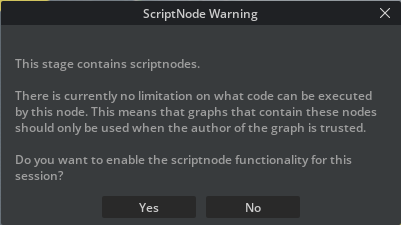

# Isaac-Sim Startup Quick Enter

This file helps me quick enter isaacsim.

## 1.Breakdown Preventing
This step is NECESSARY before the second STARTUP proscess.
```bash
ros2 run rmw_zenoh_cpp rmw_zenohd
```

## 2.Startup
```bash
cd ~/isaacsim/_build/linux-x86_64/release
./isaac-sim.sh
```

## 3.Teleop Connecting
Open a new terminal and：
```bash
source ~/ros2_ws/install/setup.bash
ros2 launch arms_teleop joystick_teleop.launch.py
```

## 4.Robot Importing
- First check the type of file:
  - If: urdf --> import
  - If: usd --> open(directly)(double click is okay)
  - Choose YES when encountering messages below:
  
  > REASON: Some of the controlling scripts are personally written, so the scripts are necessary when the ros2 control is in need.
