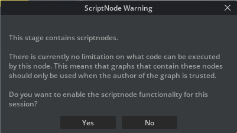

# Isaac-Sim Startup Quick Enter

This file helps me quick enter isaacsim.

## 1.Breakdown Preventing
This step is NECESSARY before the second STARTUP proscess.
```bash
ros2 run rmw_zenoh_cpp rmw_zenohd
```
- Possible error: 
  ```bash
  2026-02-25T07:05:57.582840Z  INFO ThreadId(02) zenoh::net::runtime: Using ZID: 5d5578688ad2b1e9a523cc2171f45963
  2026-02-25T07:05:57.592280Z  WARN ThreadId(02) zenoh::net::runtime::orchestrator: Unable to open listener tcp/[::]:7447: Can not create a new TCP listener bound to tcp/[::]:7447: [[::]:7447: Address already in use (os error 98) at /home/buildfarm/.cargo/git/checkouts/zenoh-cc237f2570fab813/b81e253/io/zenoh-link-commons/src/tcp.rs:52.] at /home/buildfarm/.cargo/git/checkouts/zenoh-cc237f2570fab813/b81e253/io/zenoh-links/zenoh-link-tcp/src/unicast.rs:331.
  2026-02-25T07:05:57.592310Z  INFO ThreadId(02) zenoh::api::session: close session zid=5d5578688ad2b1e9a523cc2171f45963
  2026-02-25T07:05:57.592932Z ERROR ThreadId(02) zenohc::session: Error opening session: Can not create a new TCP listener bound to tcp/[::]:7447: [[::]:7447: Address already in use (os error 98) at /home/buildfarm/.cargo/git/checkouts/zenoh-cc237f2570fab813/b81e253/io/zenoh-link-commons/src/tcp.rs:52.] at /home/buildfarm/.cargo/git/checkouts/zenoh-cc237f2570fab813/b81e253/io/zenoh-links/zenoh-link-tcp/src/unicast.rs:331.
  Error opening Session!\n[ros2run]: Process exited with failure 1
  ```
  There are typically three possible scenarios:

  - You already have a Zenoh router running: You may have already started the rmw_zenohd or standalone zenohd process in another terminal window.

  - Zombie process: A previous Zenoh process did not exit properly. Even though you closed the terminal, it is still secretly running in the background.

  - Another program occupies the port: Although 7447 is Zenoh's default port, occasionally other network services may coincidentally occupy it.

  You can use the following command to figure out the problem:
  ```bash
  sudo lsof -i :7447
  ```
  Then you might see outputs below:
  ```bash
  COMMAND     PID         USER   FD   TYPE  DEVICE SIZE/OFF NODE NAME
  rmw_zenoh 40529 shiman-liang    9u  IPv6 1686168      0t0  TCP *:7447 (LISTEN)
  ```
  Then you can use the command below to kill it:
  ```bash
  sudo kill -9 40529
  ```
  Now you can use it ~

## 2.Startup
### isaac-sim 6.0
```bash
cd ~/isaacsim/_build/linux-x86_64/release
./isaac-sim.sh
```
### isaac-sim 5.0
Enter your distrobox first. For my situation:
```bash
distrobox enter ubuntu24
```
Then start isaac-sim.
```bash
unset PYTHONPATH
unset AMENT_PREFIX_PATH

export ROS_DISTRO=jazzy
export RMW_IMPLEMENTATION=rmw_fastrtps_cpp

export ISAAC_ROOT=$HOME/isaac-sim
export LD_LIBRARY_PATH=$ISAAC_ROOT/exts/isaacsim.ros2.bridge/jazzy/lib:$LD_LIBRARY_PATH

cd $ISAAC_ROOT
./isaac-sim.sh
```
What's more, you also ought to use the command below before you start the robot node (same terminal):
```bash
export RMW_IMPLEMENTATION=rmw_fastrtps_cpp
```

## 3.Teleop Connecting
Open a new terminal and：
```bash
source ~/ros2_ws/install/setup.bash
ros2 launch arms_teleop joystick_teleop.launch.py
```

## 4.Robot Importing
- First check the type of file:
  - If: urdf --> import
  - If: usd --> open(directly)(double click is okay)
  - Choose YES when encountering messages below:
  
  > REASON: Some of the controlling scripts are personally written, so the scripts are necessary when the ros2 control is in need.


## Possible Errors
1. Once I encountered errors below, which follows with a quick shutdown 
when I attempt to open isaac sim:
```bash 
[6,730ms] [Error] [carb.scripting-python.plugin] RuntimeError: Unexpected error from cudaGetDeviceCount(). Did you run some cuda functions before calling NumCudaDevices() that might have already set an error? Error 804: forward compatibility was attempted on non supported HW
```
Furthermore, when will meet the situation below:
```bash
nvidia-smi

## you might see:
Failed to initialize NVML: Driver/library version mismatch
NVML library version: 580.126
```
This is because of the conflict between NVIDIA kernel driver version and NVIDIA Management Library (NVML) version.

You can fix this by simply rebooting your system:
```bash
sudo reboot
```