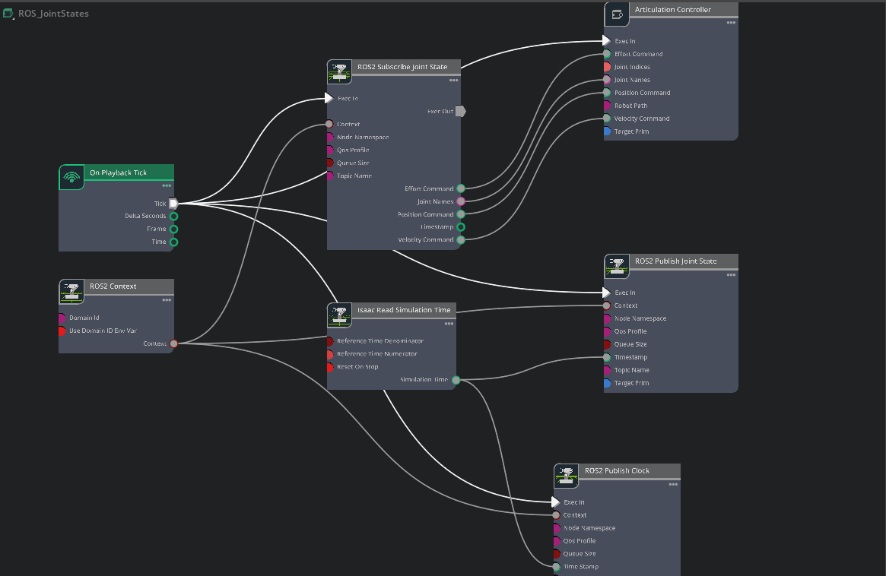
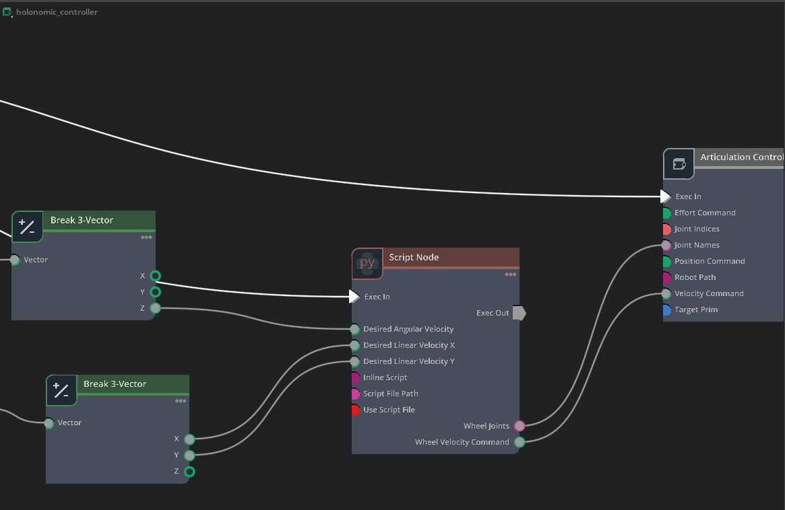

# How to Make a Robot Description Package

This file includes my personal attempts to make a robot description package based on a single urdf package.

You can find relevant official tutorial in [isaac sim robot set-up tutorial](https://docs.isaacsim.omniverse.nvidia.com/6.0.0/robot_setup_tutorials/tutorial_import_assemble_manipulator.html).

## General Steps
1. Use the xacro file to modularize components of the robot.
2. Turn to the README file and test the visualization.
    >    Note: Errors may be encountered during this stage, mostly because of the conflict between **macro definition and 
   data transmission**. You can use LLM to help fix it.
3. Write the files in /config:
   ```bash
   config
   ├── ocs2
   │   ├── fixed_base.info
   │   └── task.info
   └── ros2_control
       └── ros2_controllers.yaml
   ```
   Play the ocs control demo to make sure it works.

   Possible ERROR: 视野里只有一个baselink且是白模+末端执行器控制体。终端报错belike:
    ```bash
    [ERROR] [mobile_manipulator_mpc_node-3]: process has died [pid 26023, exit code -6, cmd '/home/shimanliang/ros2_ws/install/ocs2_mobile_manipulator_ros/lib/ocs2_mobile_manipulator_ros/mobile_manipulator_mpc_node --ros-args -r __node:=mobile_manipulator_mpc --params-file /tmp/launch_params_9stbutru --params-file /tmp/launch_params_pee3x8ze --params-file /tmp/launch_params_79vuvgqn'].
    ```
   Possible reason: task.info里各关节的顺序和robot.xacro里对应不上
            > Note: 我遇到的原因：机械臂部分复用的是已有的机械臂包，但是机械臂的末端执行器名称没和robot.xacro里的引用对上（也就是命名不一样），改成一样的就解决了。

4. Import the robot into isaac sim, assign the nodes and try riviz control.

## XACRO and URDF
1. We usually use .xacro files to manage different parts of the robot, and use the following command to automatically generate a urdf file:
   ```bash
   source ~/ros2_ws/install/setup.bash
   xacro your_xacro_file_name.xacro -o your_urdf_file_name.urdf
   ```
2. The logic of an xacro file compilation:
   ```bash
   xacro
   ├── components
   │   ├── arm.xacro
   │   ├── base.xacro
   │   ├── gripper.xacro
   │   └── wheel.xacro
   ├── component.xacro
   ├── robot.xacro
   ```
- The file "robot.xacro" serve as a general operator, where the following
xacro files in the component folder are cited and serially compiled.
- The exact files in the component folder depends on situation, which means
that it is acceptable that some robots don't own grippers or wheels and so forth.


## Blender Rendering
- Export as .obj
   > Note: with **Y as forward axis** and **Z as up axis**

- Export as .glb
   > Note: /Transform/+Y up should be disabled

## Action Graph
Take ARX-X7S as an example:

Structure:

Graphs:
- Ros_jointStates

- holonomic controller



## Error: no match articulations
```bash
[Error] [omni.physx.tensors.plugin] Pattern '/World/your_robot_name' did not match any rigid bodies
[Error] [omni.physx.tensors.plugin] Provided pattern list did not match any articulations
```
> REASON: There is a lack of **articulation root** in the robot root prim, which results from the USD file itself (instead of anything that can be monitored through the property panel in isaac sim).

However, the following script can be used to add a **physics** property to the robot prim:
```bash
from pxr import UsdPhysics, Usd
import omni.usd

# 获取当前场景
stage = omni.usd.get_context().get_stage()
# 你的机器人根Prim路径
robot_root_path = "/World/lift_2s/lift2"
robot_prim = stage.GetPrimAtPath(robot_root_path)

if robot_prim:
    # 1. 为顶层Prim添加ArticulationRootAPI（关键！）
    if not robot_prim.HasAPI(UsdPhysics.ArticulationRootAPI):
        UsdPhysics.ArticulationRootAPI.Apply(robot_prim)
        print(f"✓ 已为 {robot_root_path} 添加 ArticulationRootAPI")
    
    # 2. 遍历机器人，为所有几何体（Mesh）添加刚体和碰撞属性
    from pxr import UsdGeom
    rigid_count = 0
    for prim in Usd.PrimRange(robot_prim):
        if prim.IsA(UsdGeom.Mesh):
            # 添加RigidBodyAPI
            if not prim.HasAPI(UsdPhysics.RigidBodyAPI):
                UsdPhysics.RigidBodyAPI.Apply(prim)
            # 添加CollisionAPI
            if not prim.HasAPI(UsdPhysics.CollisionAPI):
                UsdPhysics.CollisionAPI.Apply(prim)
            rigid_count += 1
    
    print(f"✓ 已为 {rigid_count} 个Mesh部件添加刚体与碰撞属性")
    print("修复完成。请保存场景并重新测试Action Graph。")
else:
    print(f"✗ 错误：未找到路径 {robot_root_path}")
```


Sometimes you may encounter with the error situation below:
```bash
[Error] [omni.physicsschema.plugin] UsdPhysics: Nested articulation roots are not allowed.
```
> REASON: There are more than one articulation root in the robot.

Possible solution: check each element of the robot to ensure that no **articulation root** in physics property is enabled (mostly it appears in a joint, especially the root joint) . In this case, use the script below to check for once:
```bash
from pxr import UsdPhysics, Usd
import omni.usd

stage = omni.usd.get_context().get_stage()
robot_root_path = "/World/lift_2s/lift2"
robot_prim = stage.GetPrimAtPath(robot_root_path)

def find_nested_articulation_roots(prim):
    root_list = []
    for child_prim in Usd.PrimRange(prim):
        if child_prim.HasAPI(UsdPhysics.ArticulationRootAPI):
            root_list.append(child_prim.GetPath())
    return root_list

if robot_prim:
    print("=== 正在扫描机器人中所有的 ArticulationRoot ===")
    all_roots = find_nested_articulation_roots(robot_prim)
    
    if not all_roots:
        print("未发现任何 ArticulationRoot。")
    else:
        print(f"共发现 {len(all_roots)} 个 ArticulationRoot:")
        for path in all_roots:
            # 判断是否为顶层
            if path == robot_prim.GetPath():
                print(f"  [顶层] {path}")
            else:
                print(f"  [嵌套错误！] {path} <- 这个必须被移除！")
else:
    print("找不到机器人。")
```