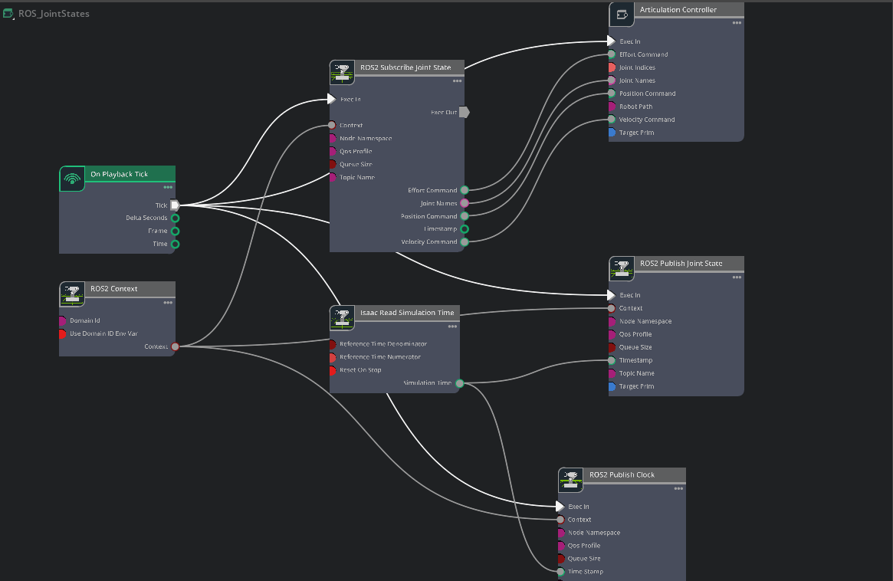
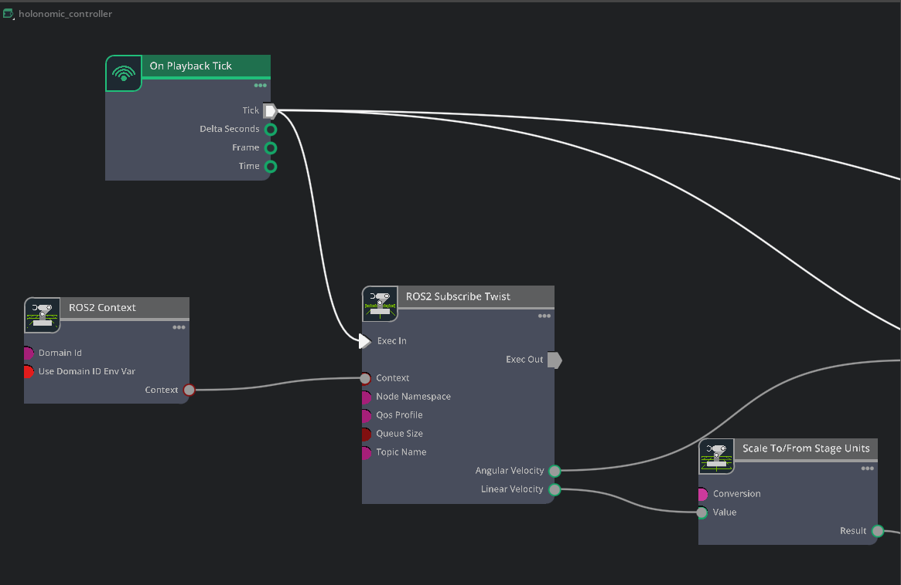
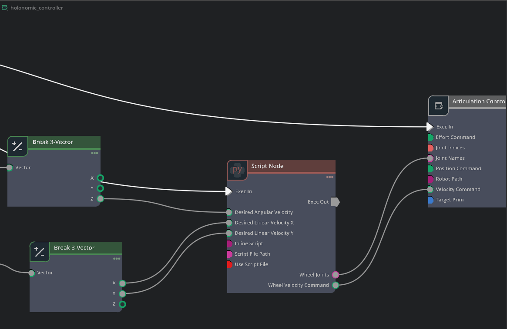

# How to Make a Robot Description Package

This file includes my personal attempts to make a robot description package based on a single urdf package.

You can find relevant official tutorial in [isaac sim robot set-up tutorial](https://docs.isaacsim.omniverse.nvidia.com/6.0.0/robot_setup_tutorials/tutorial_import_assemble_manipulator.html).

## General Steps
1. Use the xacro file to modularize components of the robot.
2. Turn to the README file and test the visualization.
    >    Note: Errors may be encountered during this stage, mostly because of the conflict between **macro definition and 
   data transmission**. You can use LLM to help fix it.
3. Write the files in /config:
   ```bash
   config
   ├── ocs2
   │   ├── fixed_base.info
   │   └── task.info
   └── ros2_control
       └── ros2_controllers.yaml
   ```
   Play the ocs control demo to make sure it works.

   Possible ERROR: 视野里只有一个baselink且是白模+末端执行器控制体。终端报错belike:
    ```bash
    [ERROR] [mobile_manipulator_mpc_node-3]: process has died [pid 26023, exit code -6, cmd '/home/shimanliang/ros2_ws/install/ocs2_mobile_manipulator_ros/lib/ocs2_mobile_manipulator_ros/mobile_manipulator_mpc_node --ros-args -r __node:=mobile_manipulator_mpc --params-file /tmp/launch_params_9stbutru --params-file /tmp/launch_params_pee3x8ze --params-file /tmp/launch_params_79vuvgqn'].
    ```
   Possible reason: task.info里各关节的顺序和robot.xacro里对应不上
            > Note: 我遇到的原因：机械臂部分复用的是已有的机械臂包，但是机械臂的末端执行器名称没和robot.xacro里的引用对上（也就是命名不一样），改成一样的就解决了。

4. Import the robot into isaac sim, assign the nodes and try riviz control.

## XACRO and URDF
1. We usually use .xacro files to manage different parts of the robot, and use the following command to automatically generate a urdf file:
   ```bash
   source ~/ros2_ws/install/setup.bash
   xacro your_xacro_file_name.xacro -o your_urdf_file_name.urdf
   ```
    >Note: 可能遇到的问题：file not found。有可能是修改了xacro文档内容，所以这个时候需要先重新编译。
    
    由于 wheel.xacro 里面定义的是一个 宏 (macro)，它不是一个完整的机器人描述文件，因此无法直接通过 xacro wheel.xacro 命令生成 URDF。

    为了单独生成这三个轮子的 URDF 进行测试或验证，需要创建一个临时的“测试桩”文件（wrapper）来调用这个宏。
    
    调用语句为：
    ```bash
    xacro test_wheel_gen.xacro wheel_name:=wheel_1 rpy:="0 0 0" robot_name:=wheel1 > wheel1.urdf
    xacro test_wheel_gen.xacro wheel_name:=wheel_2 rpy:="0 0 0" robot_name:=wheel2 > wheel2.urdf
    xacro test_wheel_gen.xacro wheel_name:=wheel_3 rpy:="0 0 3.1415926" robot_name:=wheel3 > wheel3.urdf #反转方向
    ```
2. The logic of an xacro file compilation:
   ```bash
   xacro
   ├── components
   │   ├── arm.xacro
   │   ├── base.xacro
   │   ├── gripper.xacro
   │   └── wheel.xacro
   ├── component.xacro
   ├── robot.xacro
   ```
- The file "robot.xacro" serve as a general operator, where the following
xacro files in the component folder are cited and serially compiled.
- The exact files in the component folder depends on situation, which means
that it is acceptable that some robots don't own grippers or wheels and so forth.

## Mind the DOMAIN ID
事情发生的背景是，之前我一直在宿主机本地运行这些仿真都是正常的，但是我现在为了在isaacsim里使用robot assembler进行机器人部件的组装，所以我使用容器ubuntu22安装了isaacsim5.0进行操作（原本宿主机上我使用的是isaacsim6.0），然后今天安装5.0成功后，我使用import from ros2 urdf node导入了机器人的base部分进isaac，结果我想继续导入lift部分的时候，我发现所有RVIZ都失效了开始报错，直到我在同一个终端修改了我的DOMAINID之后才恢复正常。

根源在于：Isaac Sim 的 URDF 导入插件本质上是一个活跃的 ROS 2 节点，它与你的宿主机 Launch 脚本在同一个“频道”内发生了严重的资源抢占。

以下是来自Gemini的分析：
```bash
这是一个非常典型且深刻的 ROS 2 多机/多环境通信冲突案例。通过你的背景描述，我们可以复盘出这一切混乱背后的“罪魁祸首”。

根源在于：Isaac Sim 的 URDF 导入插件本质上是一个活跃的 ROS 2 节点，它与你的宿主机 Launch 脚本在同一个“频道”内发生了严重的资源抢占。

以下是详细的原因拆解，以及为什么你之前没遇到、这次却“翻车”了的逻辑：
1. 根本原因：Isaac Sim 5.0 容器内的“隐形”发布者

当你使用 Isaac Sim 的 Import from ROS 2 URDF 节点时，Isaac Sim 并不是简单地读取一个文件，而是启动了一个内置的 ROS 2 节点（通常包含一个 Bridge）。

    UR5 的来源：Isaac Sim 的很多内置示例和测试模板（尤其是旧版 5.0）默认以 Universal Robots (UR) 作为示例。当你启动导入节点但配置未完全覆盖时，Isaac Sim 内部可能激活了一个默认的 robot_state_publisher 或参数服务器，它持续向 /robot_description 话题发送 UR5 的数据。

    话题冲突（Topic Collision）：在 ROS 2 中，如果两个节点都在发布同一个话题（如 /robot_description），订阅者（如 RViz）会交替收到两个不同的数据包。这就是为什么你看到 RViz 里关节列表“闪现”正确后立刻变回 UR5 的原因。

2. 为什么之前正常，这次不行？

这里涉及三个变量的变化：

    变量一：容器网络模式 你在启动 Ubuntu 22 容器时，极大概率使用了 --net=host 参数。这使得容器内的 ROS 2 发现机制（DDS）与宿主机完全打通。

    变量二：Isaac Sim 5.0 的行为差异 Isaac Sim 6.0 和 5.0 的 ROS 2 Bridge 实现逻辑有所不同。5.0 版本的 Import from ROS 2 URDF 节点在等待连接时，更容易产生“挂起”的残留节点。

    变量三：节点“粘性” 当你导入了 Base 部分后，Isaac Sim 的那个导入节点可能并没有完全关闭或释放话题的所有权。当你准备导入 Lift 部分时，之前的导入进程还在后台源源不断地发布旧的（或默认的）URDF 数据。

3. 中间哪一步没做好？

其实你并没有做错什么重大的事情，只是忽略了 ROS 2 默认是“全开放”通信 这一特性。

“翻车”的关键点在于： 你在同一个局域网（容器与宿主机共享网络）和同一个 DOMAIN_ID 下，运行了两个都试图定义“机器人是谁”的系统。

    宿主机的 manipulator.launch.py 说：“我是 ARX 机器人。”

    Isaac Sim 的导入插件（可能带有残留或默认值）说：“我是 UR5 机器人。”

    RViz 作为一个“听众”，由于 ROS 2 没有像 ROS 1 那样的 Master 管理机制，它会尝试接收双方的信息，导致混乱。

4. 为什么修改 DOMAIN_ID 就好了？

修改 DOMAIN_ID 相当于给你的终端加了一层物理隔离屏障：

    你的宿主机终端（DOMAIN_ID 88）现在只能听到自己发出的 ARX 信号。

    容器里的 Isaac Sim（DOMAIN_ID 0）发出的 UR5 信号被挡在了屏障之外。

    结果：RViz 只接收 DOMAIN 88 的数据，自然就清净了。

5. 深度复盘：未来如何避免？

在使用 Isaac Sim 与 ROS 2 协同工作时，建议遵循以下流程：

    明确隔离环境：如果你只是想从 ROS 2 导入 URDF，最好在启动 Isaac Sim 容器时，就给它分配一个特定的 ROS_DOMAIN_ID，或者在容器启动命令中加入 export ROS_LOCALHOST_ONLY=1。

    清理残留话题：每次导入失败或更换部件后，最好在宿主机查一下 ros2 topic echo /robot_description，看输出的是不是你想要的东西。

    注意多重节点名：你之前看到的多个 /dwj_Robot_node 说明 Isaac Sim 或其底层驱动在尝试重连时产生了多个僵尸节点，这些节点会不停地重置参数服务器。

总结： 这不是你的技术失误，而是 ROS 2 自动发现机制（DDS）在复杂开发环境下的典型副作用。你现在的解决方法（修改 DOMAIN_ID）正是处理这种冲突的最标准、最有效的专业手段。
```

## Blender Rendering
- Export as .obj
   > Note: with **Y as forward axis** and **Z as up axis**

- Export as .glb
   > Note: /Transform/+Y up should be disabled

## Robot Assembler Using
> General Steps: 
> 1. 启动RVIZ
> 2. 在isaac中打开import from ROS2 urdf node 

## Action Graph
Take ARX-X7S as an example:

Structure:

Graphs:
- Ros_jointStates

- holonomic controller



## Error: no match articulations
```bash
[Error] [omni.physx.tensors.plugin] Pattern '/World/your_robot_name' did not match any rigid bodies
[Error] [omni.physx.tensors.plugin] Provided pattern list did not match any articulations
```
> REASON: There is a lack of **articulation root** in the robot root prim, which results from the USD file itself (instead of anything that can be monitored through the property panel in isaac sim).

However, the following script can be used to add a **physics** property to the robot prim:
```bash
from pxr import UsdPhysics, Usd
import omni.usd

# 获取当前场景
stage = omni.usd.get_context().get_stage()
# 你的机器人根Prim路径
robot_root_path = "/World/lift_2s/lift2"
robot_prim = stage.GetPrimAtPath(robot_root_path)

if robot_prim:
    # 1. 为顶层Prim添加ArticulationRootAPI（关键！）
    if not robot_prim.HasAPI(UsdPhysics.ArticulationRootAPI):
        UsdPhysics.ArticulationRootAPI.Apply(robot_prim)
        print(f"✓ 已为 {robot_root_path} 添加 ArticulationRootAPI")
    
    # 2. 遍历机器人，为所有几何体（Mesh）添加刚体和碰撞属性
    from pxr import UsdGeom
    rigid_count = 0
    for prim in Usd.PrimRange(robot_prim):
        if prim.IsA(UsdGeom.Mesh):
            # 添加RigidBodyAPI
            if not prim.HasAPI(UsdPhysics.RigidBodyAPI):
                UsdPhysics.RigidBodyAPI.Apply(prim)
            # 添加CollisionAPI
            if not prim.HasAPI(UsdPhysics.CollisionAPI):
                UsdPhysics.CollisionAPI.Apply(prim)
            rigid_count += 1
    
    print(f"✓ 已为 {rigid_count} 个Mesh部件添加刚体与碰撞属性")
    print("修复完成。请保存场景并重新测试Action Graph。")
else:
    print(f"✗ 错误：未找到路径 {robot_root_path}")
```


Sometimes you may encounter with the error situation below:
```bash
[Error] [omni.physicsschema.plugin] UsdPhysics: Nested articulation roots are not allowed.
```
> REASON: There are more than one articulation root in the robot.

Possible solution: check each element of the robot to ensure that no **articulation root** in physics property is enabled (mostly it appears in a joint, especially the root joint) . In this case, use the script below to check for once:
```bash
from pxr import UsdPhysics, Usd
import omni.usd

stage = omni.usd.get_context().get_stage()
robot_root_path = "/World/lift_2s/lift2"
robot_prim = stage.GetPrimAtPath(robot_root_path)

def find_nested_articulation_roots(prim):
    root_list = []
    for child_prim in Usd.PrimRange(prim):
        if child_prim.HasAPI(UsdPhysics.ArticulationRootAPI):
            root_list.append(child_prim.GetPath())
    return root_list

if robot_prim:
    print("=== 正在扫描机器人中所有的 ArticulationRoot ===")
    all_roots = find_nested_articulation_roots(robot_prim)
    
    if not all_roots:
        print("未发现任何 ArticulationRoot。")
    else:
        print(f"共发现 {len(all_roots)} 个 ArticulationRoot:")
        for path in all_roots:
            # 判断是否为顶层
            if path == robot_prim.GetPath():
                print(f"  [顶层] {path}")
            else:
                print(f"  [嵌套错误！] {path} <- 这个必须被移除！")
else:
    print("找不到机器人。")
```